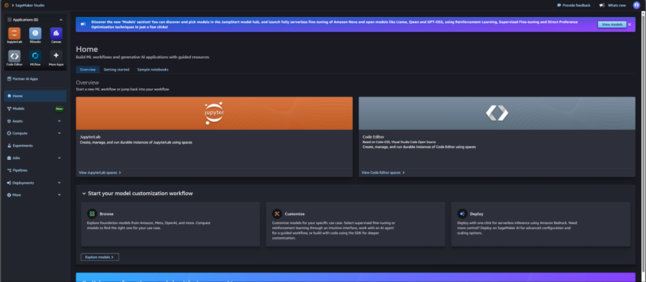
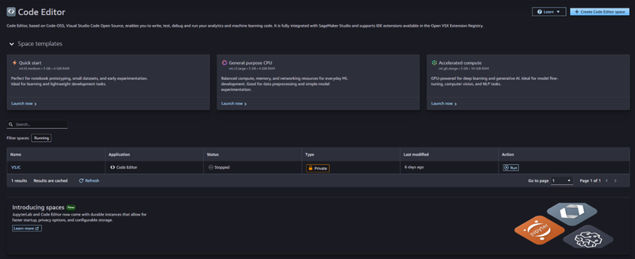
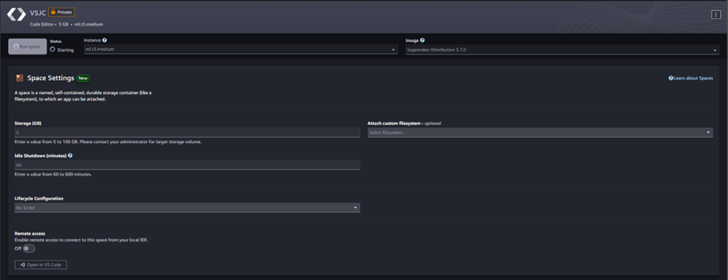
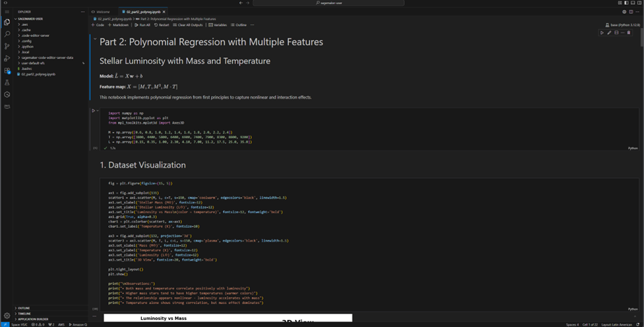
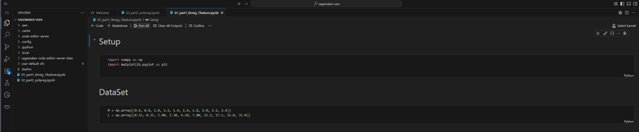
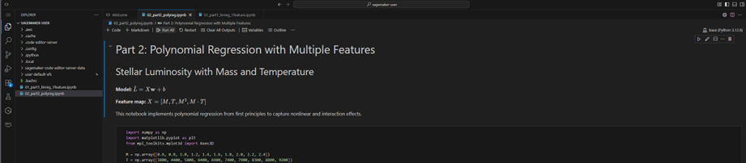
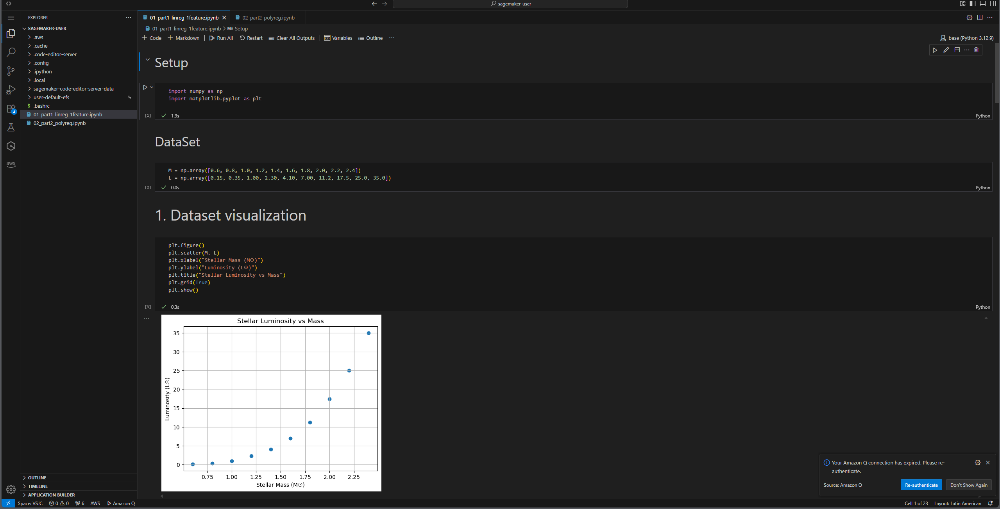
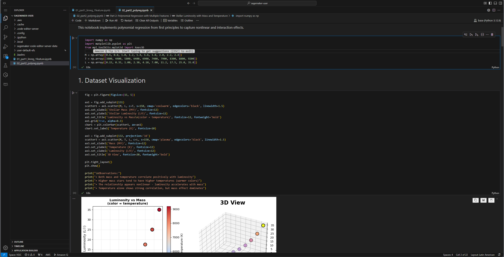
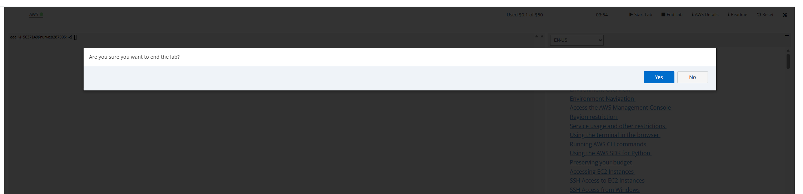

# RegressionCloud
---

*Created by:* Julian David Castiblanco Real

---
## Description
---
This laboratory explores the modeling of stellar luminosity through linear and polynomial regression techniques developed from first principles, without the use of pre-built machine learning libraries. The objective is to gain a deeper understanding of how prediction models are constructed by explicitly defining the hypothesis function, the cost function, and the gradient-based optimization process, using observational stellar data as a case study.

The work is conducted within the framework of a Machine Learning bootcamp and emphasizes the importance of understanding model construction and execution in cloud-based and enterprise-level systems, where machine learning is increasingly treated as a core architectural capability rather than a black-box tool.

**Prerequisitos:**
- Python 3.8 or higher (As a recomendation, the newer versions are better due to the compatibility with the creations of virtual environments in multiple IDEs)
- Jupyter Notebook or JupyterLab
- libraries:
  - ``numpy``
  - ``matplotlib``
 
**Execution:**
1. Clone Repository:
   ```
   git clone <Repository_URL>
   cd <Repository_name>
   ```

2. Setup the virtual environment:
   ```
   python -m venv venv
   source venv/bin/activate       # On Linux/Mac
   venv\Scripts\activate          # On Windows
   ```

3. Start running each block of code so you can see the results
---
### Part 1
For this part of the lab, we implement a simple linear regression model to study the relationship between stellar mass (M) and stellar luminosity (L) using a single input feature.
The model assumes that luminosity can be approximated as a linear function of mass, expressed as:

$$
\hat{L} = wM + b
$$

In this formulation, \(M\) denotes the stellar mass, \(w\) corresponds to the slope of the model, and \(b\) represents the intercept.
Model performance is evaluated using the Mean Squared Error (MSE), defined as:

$$
J(w, b) = \frac{1}{2m} \sum_{i=1}^{m} (\hat{L}^{(i)} - L^{(i)})^2
$$

The gradients of the loss function with respect to both parameters were derived analytically and used to iteratively update the model through gradient descent. Two implementations were explored: a loop-based version for conceptual clarity and a vectorized version for computational efficiency.

Different learning rates were evaluated to analyze their effect on training stability and convergence speed. In addition, visualizing the cost function over a range of parameter values provided insight into the structure of the optimization problem.

Overall, the linear model successfully captures the broad increasing trend between mass and luminosity but fails to represent the rapid growth observed at higher masses. The convex shape of the cost surface confirms the presence of a single global optimum, while the learning rate experiments demonstrate the importance of proper hyperparameter selection for effective training.

### Results
This notebook implements linear regression from first principles to model stellar luminosity as a function of stellar mass. It includes dataset visualization, explicit definition of the linear model and Mean Squared Error (MSE) loss, analytical gradient derivation, and gradient descent optimization using both loop-based and vectorized implementations.

The analysis explores the effect of different learning rates on convergence behavior and visualizes the cost surface to illustrate the convex optimization landscape. While the model captures the general increasing trend between mass and luminosity, the results show clear underfitting at higher stellar masses due to the linear assumption.

To view the full implementation and results, see the notebook at the following link:
[Open Notebook 1](01_part1_linreg_1feature.ipynb)

---
### Part 2
In the second part of the lab, the linear model is extended to capture nonlinear behavior and feature interactions by incorporating polynomial feature engineering. Three progressively more expressive feature sets are evaluated:
- **M1:** \( [M, T] \)
- **M2:** \( [M, T, M^2] \)
- **M3:** \( [M, T, M^2, M \cdot T] \)
The full polynomial model (M3) is defined as:

$$
\hat{L} = w_1 M + w_2 T + w_3 M^2 + w_4 (M \cdot T) + b
$$

This formulation enables the model to represent nonlinear dependencies between stellar mass, temperature, and luminosity that cannot be captured by a simple linear model.

All models are trained using fully vectorized gradient descent, and training behavior is analyzed through loss-versus-iteration plots. The impact of feature complexity is evaluated by comparing final loss values and predicted-versus-actual outputs across models.


### Results

The results show a consistent reduction in loss as additional polynomial and interaction terms are introduced. The full polynomial model achieves the lowest error, highlighting the importance of higher-order features and interactions for accurately modeling stellar luminosity.

This notebook also analyzes the sensitivity of the cost function to the interaction coefficient and demonstrates inference by predicting the luminosity of a new star.
To view the full implementation and results, see the notebook at the following link:
[Open Notebook 2](02_part2_polyreg.ipynb)

--- 
### AWS SageMaker Execution Evidence

The purpose of this section is to demonstrate the execution of both previously developed Jupyter notebooks within the AWS SageMaker environment configured during the course. The notebooks were uploaded to the SageMaker domain and executed using the Code Editor environment to validate that all cells run successfully in a cloud-based setting.

The following steps summarize the process used to upload and run the notebooks:

1. We open AWS Academy and look for the lab created by the teacherand start the lab and access AWS.

2. Inside AWS use the search bar in order to find SageMaker Studio (Select the one that says AI). After that select the option Domains in the side bar and click the Open Studio button so you can access SageMaker; if done correctly, you''l see the next page:


3. In the SageMaker we click to open the editor and run our VS code if we have it:


4. Then we click on run button and click on open editor:



5. Then we will upload our notebooks in the code editor and start the configuration.

6. Inside the editor, the resemblance with Visual Studio Code will help in the following steps. Select the Open Folder option and select ``/home/sagemaker-user``folder so we can start uploading our notebooks.

7. we will drag the notebooks to the window:



8. we select the kernel to run our notebooks:


9. When the Kernel is selected, click the Run All button in both Notebooks to execute all code cells:


10. After execution, we verify each cell searching any error, if there's no error, the process was succesfully:



11. then we will save changes and log out from AWS:


**Local Execution vs AWS SageMaker Execution**

Both notebooks executed successfully in the local environment and within AWS SageMaker, producing identical numerical results and visualizations. No modifications to the code were necessary when transitioning to the cloud platform. The only noticeable difference was a slight increase in execution time when running the notebooks in SageMaker, which can be attributed to the overhead of the cloud-based execution environment.

---
### Conclusions

This lab examined regression modeling by first applying a simple linear model to relate stellar mass and luminosity, and then enhancing the model through polynomial features and interaction terms. Building the model components from first principles—including the loss function, gradient derivation, and gradient descent—provided a clear understanding of the optimization process and the influence of learning rate selection on convergence behavior.

The visualization of the cost surface and training curves offered valuable insight into model stability and the presence of a single global minimum. While the linear model successfully captured the general upward trend in the data, it was unable to represent the rapid increase in luminosity observed at higher stellar masses. Expanding the feature space with nonlinear and interaction terms significantly improved model expressiveness and led to lower training error.

Overall, the lab emphasizes the critical role of feature engineering, systematic experimentation, and result interpretation when developing regression models for real-world, nonlinear phenomena.
